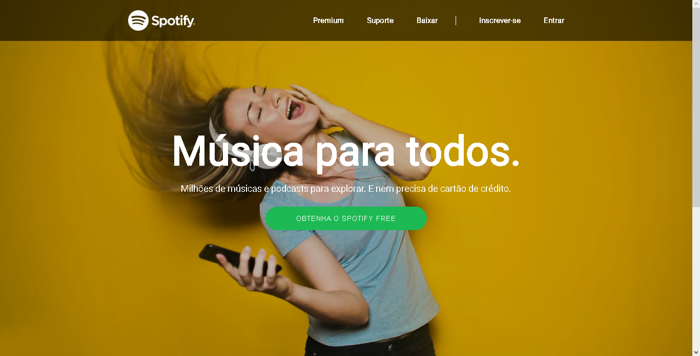

<h1 align="center"> Spotify Website 🎶 </h1>

## Briefing 📄

Clone do antigo website do spotify.

Link para o vídeo do projeto: [dicas para devs](https://www.youtube.com/watch?v=qjsRinLKiLc)

<h2 align="left"> Objetivos 📌 </h2>

- Melhorar skills como front-end developer

---
<h3 align="center"> Main page 📷 </h3>

<h3 align="center"> Tecnologias utilizadas 🤖 </h3>

> 

